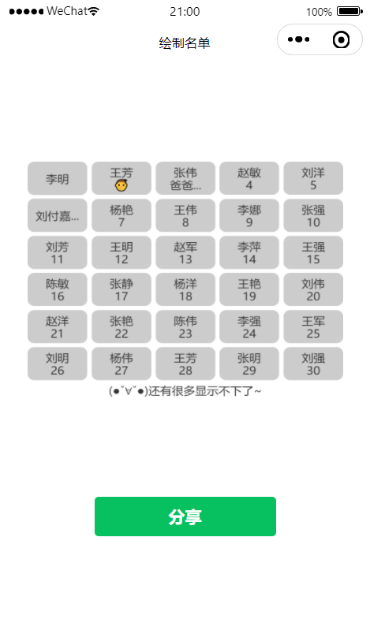

# Painter Draw Namelist 微信小程序

这是一个用于绘制名单的微信小程序，你可以便捷地生成名单图片并分享给其他用户



## TODO

- [x] 可配置画布宽高
- [x] 可配置列数
- [x] 可配置元素沟槽宽度
- [x] 可配置元素内边距
- [x] 可配置画布字体颜色
- [x] 可配置画布字体大小
- [x] 可配置元素行高
- [x] 可配置元素背景颜色
- [x] 可配置元素圆角大小
- [x] 可配置底部提示信息
- [x] 默认使用 \n 换行
- [x] 支持 Emoji 表情符号
- [x] 支持 1 行或 2 行文本居中显示
- [x] 文字溢出显示 “...”
- [ ] 还需要什么功能？请提交一个 [Issue](https://github.com/lessroc/PainterDrawNamelist/issues) 来告诉我

## 如何运行

1. 克隆或下载项目到本地计算机

    ```bash
    git clone https://github.com/lessroc/PainterDrawNamelist.git
    ```

2. 打开微信开发者工具

3. 在微信开发者工具中选择 "项目" 并点击 "导入项目"

4. 在导入项目对话框中，选择项目文件夹并填写小程序的 AppID

5. 点击 "导入" 完成导入

6. 在微信开发者工具中点击 "预览" 来预览小程序，或点击 "上传" 来提交小程序到微信小程序平台

## 目录结构

```text
.
|-- app.js
|-- app.json
|-- app.wxss
|-- components
|   `-- painter
|       |-- lib
|       |   |-- calc.js
|       |   |-- downloader.js
|       |   |-- gradient.js
|       |   |-- pen.js
|       |   |-- qrcode.js
|       |   |-- sha1.js
|       |   |-- util.js
|       |   `-- wx-canvas.js
|       |-- painter.js
|       |-- painter.json
|       `-- painter.wxml
|-- pages
|   `-- index
|       |-- index.js
|       |-- index.json
|       |-- index.wxml
|       `-- index.wxss
|-- project.config.json
|-- project.private.config.json
|-- sitemap.json
`-- utils
    |-- drawData.js
    `-- drawSharingDiagram.js

```

项目包含以下文件和目录：

- `app.js`, `app.json`, `app.wxss`: 小程序的主要配置文件

- `components/painter`: 包含用于绘制名单的组件

- `pages/index`: 包含小程序的主页面，用于展示名单和分享功能

- `project.config.json`, `project.private.config.json`, `sitemap.json`: 项目配置文件

- `utils`: 包含用于绘制名单的工具和数据

## 如何使用

1. 打开小程序后，名单会自动绘制在页面上

2. 点击 "分享" 按钮可以将绘制好的名单分享给其他用户

## 代码演示

- pages/index.wxml

    ```wxml
    <view class="container">
      <image src="{{shareImage}}" />
    </view>
    <painter palette="{{data}}" bind:imgOK="onImgOK" widthPixels="1000" />
    <button type="primary" open-type="share">分享</button>
   ```

- pages/index.js

    ```js
    import { drawData } from '../../utils/drawData';
    import DrawSharingDiagram from '../../utils/drawSharingDiagram';
    
    Page({
      data: {
        data: {},
        shareImage: '',
      },
    
      onLoad() {
        this.setData({
          data: new DrawSharingDiagram().palette(drawData),
        });
      },
    
      onImgOK(e) {
        this.setData({ shareImage: e.detail.path });
      },
    
      onShareAppMessage() {
        return {
          title: '绘制名单',
          path: 'pages/index/index',
          imageUrl: this.data.shareImage,
        };
      },
    });
    ```

- 画布配置及默认值(rpx)，画布宽高比建议5:4

    ```js
    const options = {
       canvasWidth: 750,     // 画布宽度
       canvasHeight: 600,    // 画布高度
       columns: 5,           // 列数
       trench: 10,           // 沟槽
       padding: 10,          // 内边距
       color: '#333',        // 字体颜色
       fontSize: 28,         // 字体大小
       lineHeight: 32,       // 行高
       bgc: '#ccc',          // 背景色
       bdrs: 16,             // 圆角大小
       bottomInfo: '(●ˇ∀ˇ●)还有很多显示不下了~', // 底部提示信息
    };
    ```

- 绘制数据示例

    ```js
    export const drawData = [
       '李明',
       '王芳\n👦',
       '张伟\n爸爸\n妈妈',
       '赵敏\n4',
       '刘洋\n5',
       '刘付嘉欣',
       '杨艳\n👧',
       '王伟\n8',
       '李娜\n9',
       '张强\n10',
       // ...
    ];
    ```

## 技术栈

- [微信小程序](https://developers.weixin.qq.com/miniprogram/dev/framework/) + [Painter](https://github.com/Kujiale-Mobile/Painter)

## 作者

- [lessroc](https://github.com/lessroc)

## 鸣谢

- [Painter](https://github.com/Kujiale-Mobile/Painter)

## 许可证

该项目采用 MIT 许可证，详细信息请查看 [LICENSE](LICENSE) 文件

## 贡献

如果您希望为这个项目做出贡献，请参考 [CONTRIBUTING.md](CONTRIBUTING.md) 文件
